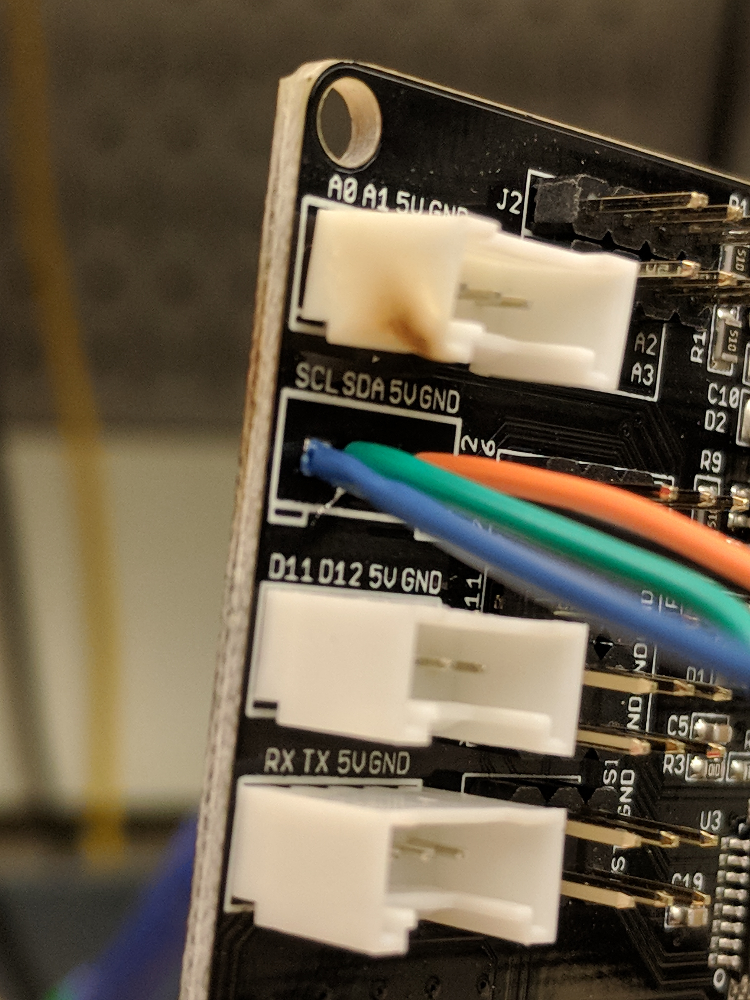
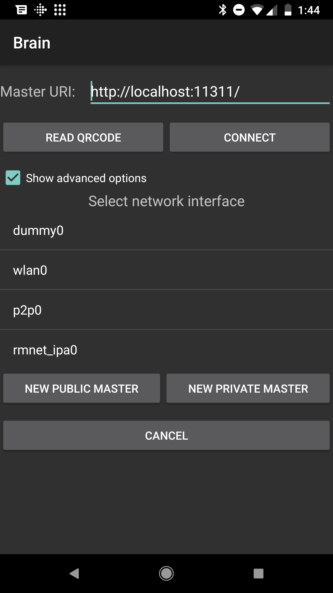

# Weekly Update 3

**Vikram**

+ Finished Assembling chassis
+ Reverse engineering Herculues i2c protocol
+ REverse engineered the serial protocol
+ Wrote I2C driver to interface esp32 and chassis
+ Working on debugging why the atmega chip on the i2c driver cannot be flashed.

**David**

+ With Vikram, reverse-engineered the Hercules Motor Control Board interface
+ Aided assembling the chassis (soldered electrical connections)
+ De-soldered the Grove connector header for I2C and replaced it with wires soldered directly to the board

+ Compiled rosjava core packages for Android
+ Verified ROS communication with sample application to create ROS master node and test pub/sub communication

+ Currently figuring out how to cross-compile C++ ROS Packages for use in the app via the Android NDK
+ Blocked on build errors

**Naveen**

+ Connected to LIDAR using provided hardware
+ Set up small demo that signalled STOP when front of LIDAR approached object
